# Installation Guide

This guide has step-by-step instructions to help you set up the DICOM De-Identification tool. Don't worry if you're not comfortable with terminals or command lines—we'll walk you through it!

---

## What You'll Need

1. **Python 3.8 or newer** — A programming language (we'll install it together)
2. **Text editor or IDE** — To run commands (built into your computer)
3. **About 10-15 minutes** — Time to set up

---

## Step-by-Step Installation

### Step 1: Install Python

Python is the language this tool runs on.

1. Go to: **<https://www.python.org/downloads>**
2. Click the big yellow **"Download Python"** button (it will be the latest version, like 3.12)
3. Run the downloaded file
4. **IMPORTANT:** Check the checkbox that says **"Add Python to PATH"** — this is crucial!
5. Click **Install Now** and wait for it to finish

**Verify it worked:**

- **Windows:** Open Command Prompt (search for "cmd" in Start menu)
- **macOS:** Open Terminal (search for "terminal" in Spotlight)
- **Linux:** Open Terminal

Type this command and press Enter:

```bash
python --version
```

You should see something like: `Python 3.x.x`

If you see this, Python is installed correctly!

### Git Installation Screenshots

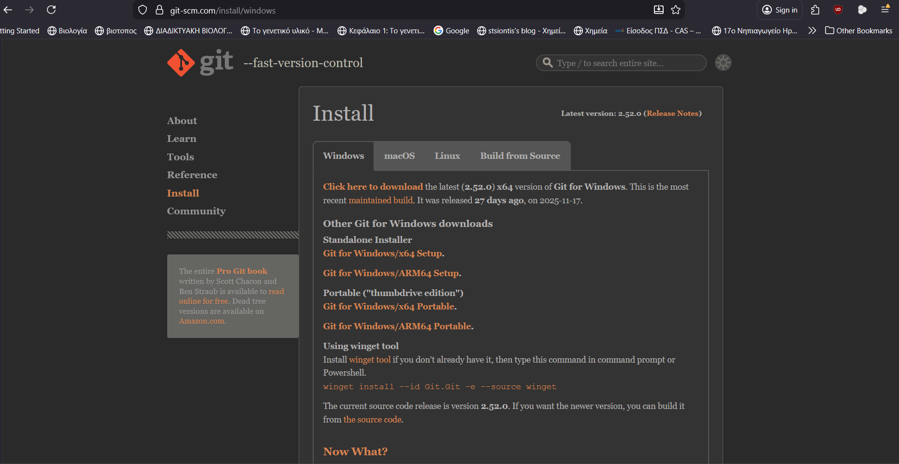
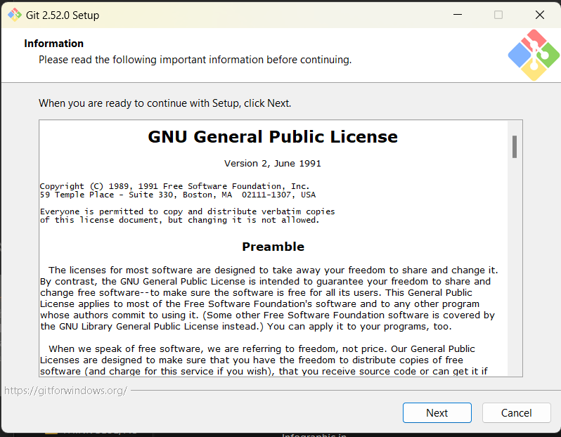
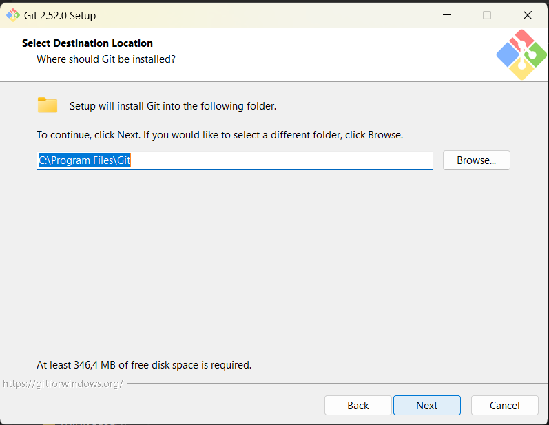
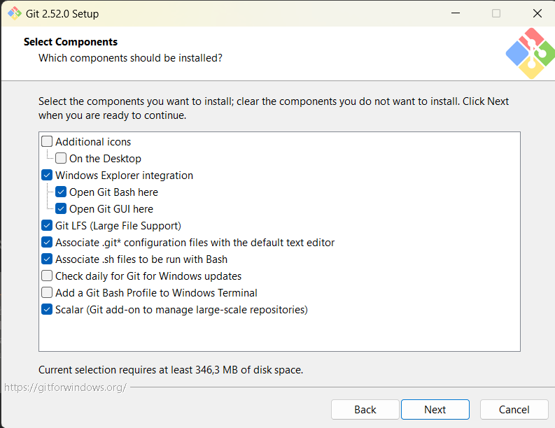
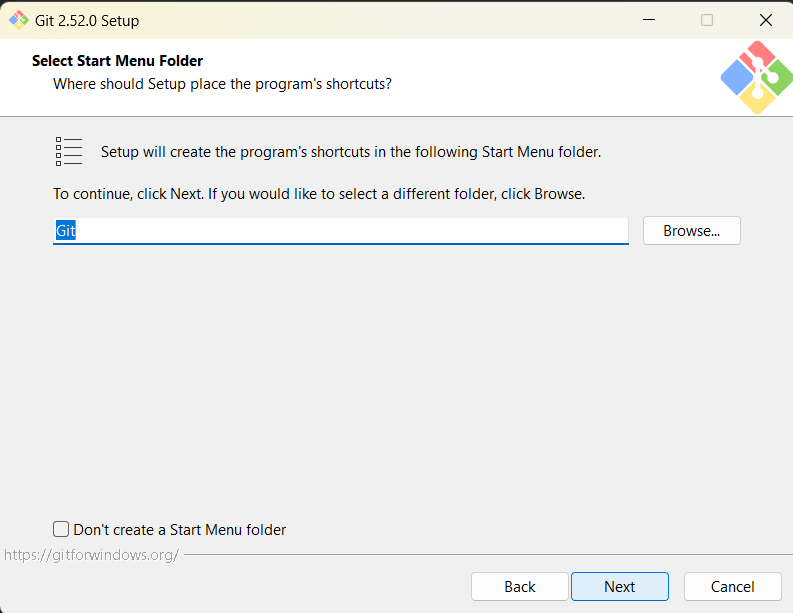
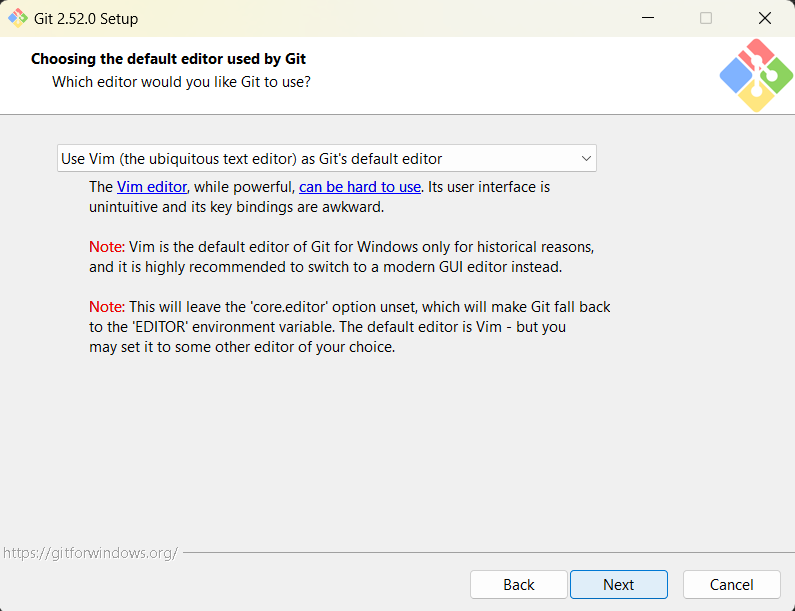
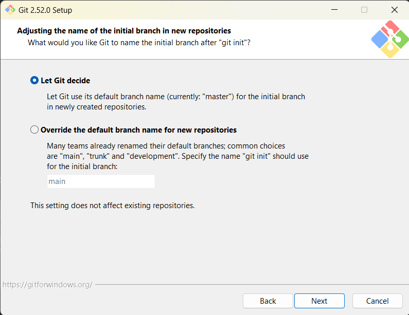
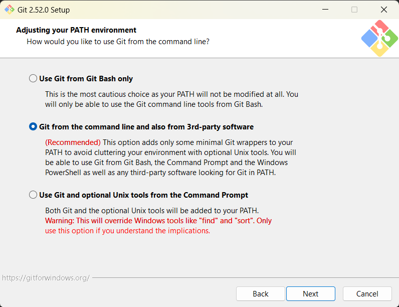
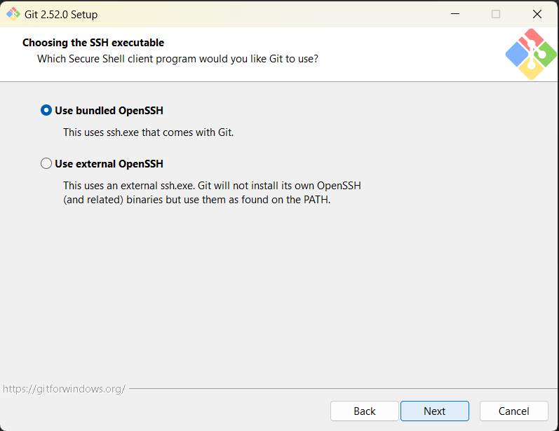
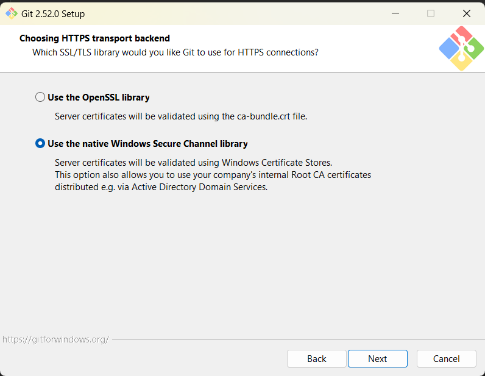
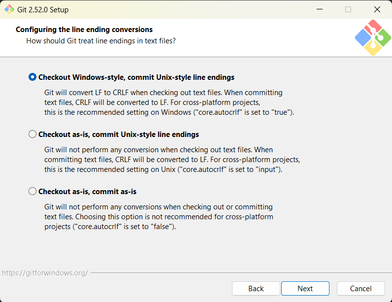
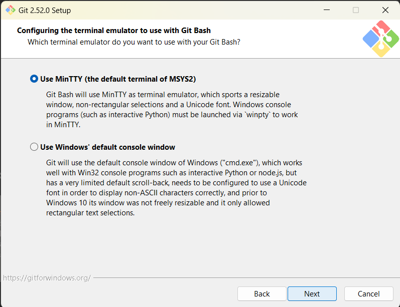
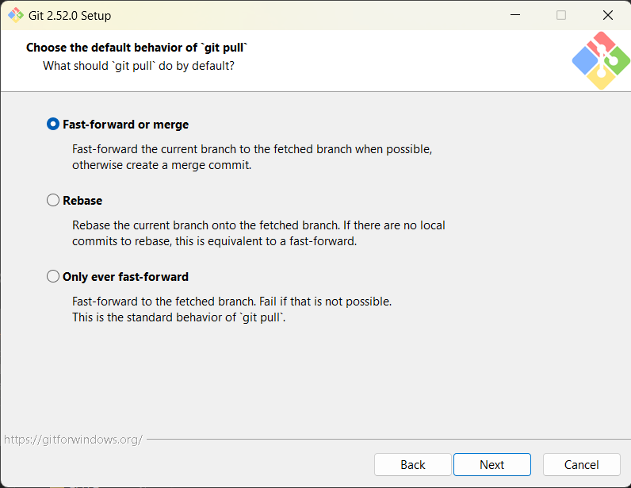
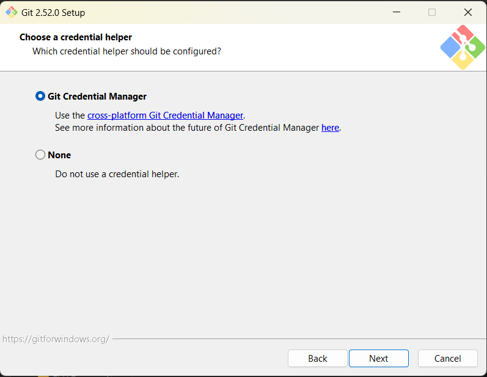
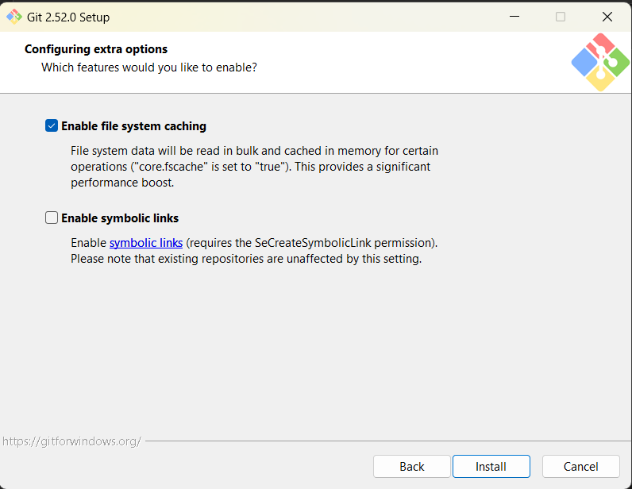
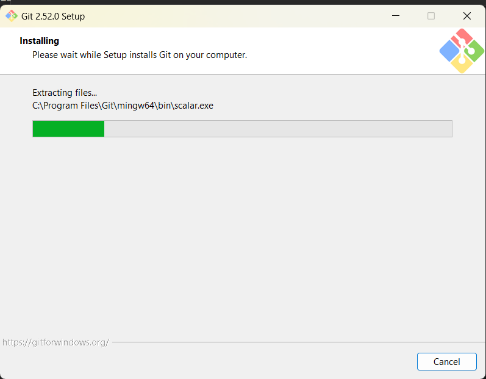
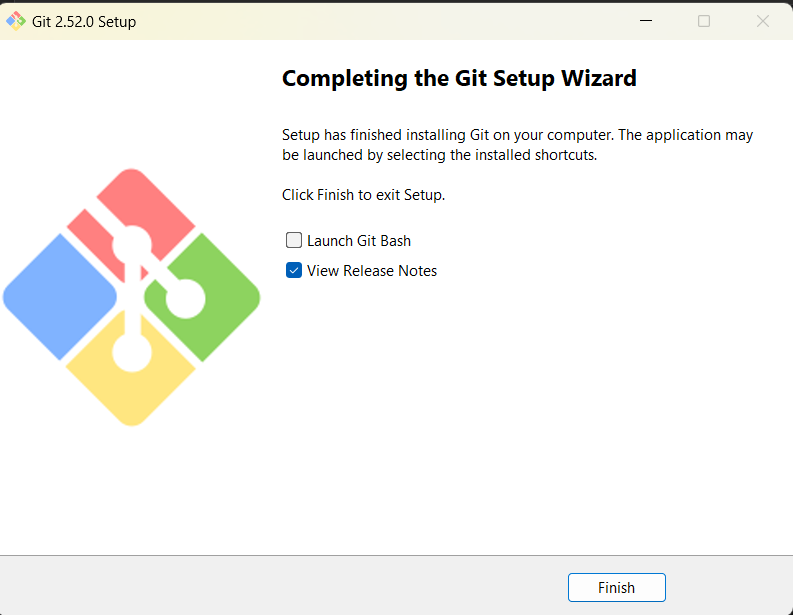

---

### Step 2: Get the Project Files

Two options (Option A is easiest):

#### Option A: Download as ZIP (Recommended for Non-Technical Users)

1. Go to: **<https://github.com/jsfakian/dicom_anonymization>**
2. Click the **Code** button (green button on the right)
3. Click **Download ZIP**
4. Find the ZIP file and **Extract** it (right-click → Extract)
5. Open the extracted folder — you should see these files:
   - `anonymizer_pro.py` ← This is the main tool!
   - `README.md`
   - `GDPR-strict.json`
   - `requirements.txt`

#### Option B: Use Git (If You're Comfortable)

1. Download Git: **<https://git-scm.com/downloads>**
2. Install with default options
3. Open Command Prompt or Terminal
4. Run these commands:

   ```bash
   git clone https://github.com/jsfakian/dicom_anonymization.git
   cd dicom_anonymization
   ```

#### How to Open Command Prompt/PowerShell (Windows)

1. Click the **Start** button (or press the **Windows key**)
2. Type **cmd** or **PowerShell**
3. Click **Command Prompt** or **Windows PowerShell**

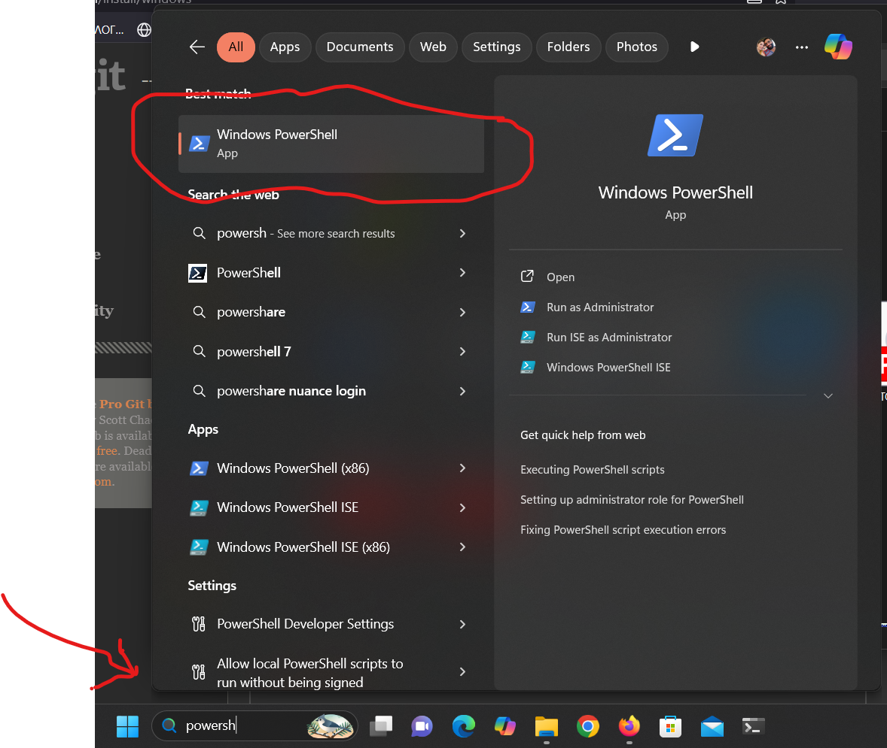

#### Cloning Repository Screenshot

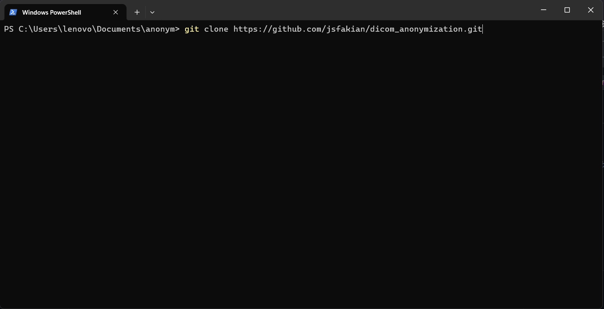

---

### Step 3: Create a Virtual Environment

A virtual environment isolates this project's tools from the rest of your computer. It's safer and cleaner.

#### Windows

1. Open **Command Prompt** (search for "cmd")
2. Navigate to your project folder:

   ```powershell
   cd C:\Users\YourUsername\Documents\dicom_anonymization
   ```

   (Replace with where you extracted/cloned the folder)
3. Run:

   ```powershell
   python -m venv .venv
   .venv\Scripts\activate
   ```

You should see `(.venv)` appear before your cursor. This means the virtual environment is active.

#### macOS/Linux

1. Open **Terminal**
2. Navigate to your project folder:

   ```bash
   cd ~/Documents/dicom_anonymization
   ```

   (Or wherever you extracted/cloned the folder)
3. Run:

   ```bash
   python3 -m venv .venv
   source .venv/bin/activate
   ```

Again, you should see `(.venv)` appear. If you don't see it, try replacing `python3` with `python` in the commands above.

---

### Step 4: Install Required Libraries

These are tools that the anonymizer needs to work with DICOM files.

With `(.venv)` visible in your terminal, run:

```bash
pip install -r requirements.txt
```

Wait for it to complete. You'll see a lot of text, then a message like: `Successfully installed pydicom, numpy, opencv-python...`

If you get an error, try:

```bash
pip install --upgrade pip
pip install -r requirements.txt
```

---

### Step 5: Verify Success

Let's make sure everything is working:

1. In your terminal (with `(.venv)` showing), run:

   ```bash
   python anonymizer_pro.py --help
   ```

2. You should see help text with options like:

   ```bash
   usage: anonymizer_pro.py [-i INPUT] [-p PROFILE] [--salt SALT] ...
   ```

If you see this, **Congratulations! Installation is complete!**

---

## How to Use

### Basic Example

Before running the tool every time, make sure to activate the virtual environment first:

**Windows:**

```powershell
.venv\Scripts\activate
```

**macOS/Linux:**

```bash
source .venv/bin/activate
```

Then run the anonymizer:

```bash
python anonymizer_pro.py -i my_dicom_file.dcm -p GDPR-strict.json --salt "my-secret-phrase"
```

**Replace:**

- `my_dicom_file.dcm` → path to your DICOM file
- `my-secret-phrase` → a secret phrase you choose (e.g., "MySecretPhrase123")

### More Detailed Usage

See [README.md](README.md) for:

- Detailed command-line options
- Understanding anonymization profiles
- Best practices and security tips
- Troubleshooting common issues

---

## Common Problems & Solutions

| Problem | Solution |
| --------- | ---------- |
| `python command not found` | Python may not be in PATH. Reinstall Python and make sure to check "Add Python to PATH" |
| `(.venv) doesn't appear after activation` | Try `python -m venv .venv` again, then activate |
| `Module not found` | Make sure you're in the virtual environment (see `(.venv)` in terminal) and run `pip install -r requirements.txt` |
| `Permission denied` | Your file permissions may need adjustment. Ask your system administrator for help |
| `No such file or directory` | Check that your DICOM file path is correct and the file exists |

---

## Getting Help

- **Detailed commands:** Run `python anonymizer_pro.py --help`
- **More information:** Read [README.md](README.md)
- **Profile details:** Look at `GDPR-strict.json` and `research-pseudonymized.json` files
- **GitHub issues:** Report bugs at <https://github.com/jsfakian/dicom_anonymization/issues>
